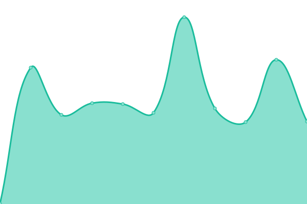
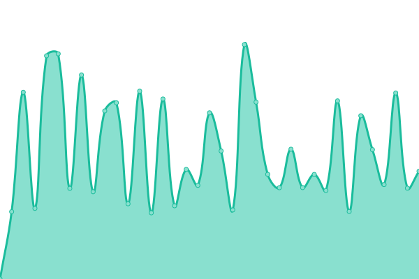

# [📈 Live Status](https://dtk2.github.io/upptime): <!--live status--> **🟩 All systems operational**

This repository contains the open-source uptime monitor and status page for [dtk2](https://dtk2.github.io/upptime), powered by [Upptime](https://github.com/upptime/upptime).

With [Upptime](https://upptime.js.org), you can get your own unlimited and free uptime monitor and status page, powered entirely by a GitHub repository. We use [Issues](https://github.com/dtk2/upptime/issues) as incident reports, [Actions](https://github.com/dtk2/upptime/actions) as uptime monitors, and [Pages](https://dtk2.github.io/upptime) for the status page.

<!--start: status pages-->
<!-- This summary is generated by Upptime (https://github.com/upptime/upptime) -->
<!-- Do not edit this manually, your changes will be overwritten -->
<!-- prettier-ignore -->
| URL | Status | History | Response Time | Uptime |
| --- | ------ | ------- | ------------- | ------ |
|  [AutosUsados Site](http://www.autosusados.cl/) | 🟩 Up | [autos-usados-site.yml](https://github.com/dtk2/upptime/commits/HEAD/history/autos-usados-site.yml) | 

 820ms
     
 | 

<a href="https://dtk2.github.io/upptime/history/autos-usados-site">99.56%</a>
    

|  [AutosUsadoe Next](https://autosusados.web.app/) | 🟩 Up | [autos-usadoe-next.yml](https://github.com/dtk2/upptime/commits/HEAD/history/autos-usadoe-next.yml) | 

 2682ms
     
 | 

<a href="https://dtk2.github.io/upptime/history/autos-usadoe-next">100.00%</a>
    

|  [Tattersall](https://autotattersall.cl/) | 🟩 Up | [tattersall.yml](https://github.com/dtk2/upptime/commits/HEAD/history/tattersall.yml) | 

 935ms
     
 | 

<a href="https://dtk2.github.io/upptime/history/tattersall">96.93%</a>
    

|  [Auth Service](https://api.servicesdtk2.cl/v1/auth/_health) | 🟩 Up | [auth-service.yml](https://github.com/dtk2/upptime/commits/HEAD/history/auth-service.yml) | 

 1195ms
     
 | 

<a href="https://dtk2.github.io/upptime/history/auth-service">99.57%</a>
    

<!--end: status pages-->

[**Visit our status website →**](https://dtk2.github.io/upptime)

## 📄 License

- Powered by: [Upptime](https://github.com/upptime/upptime)
- Code: [MIT](./LICENSE) © [dtk2](https://dtk2.github.io/upptime)
- Data in the `./history` directory: [Open Database License](https://opendatacommons.org/licenses/odbl/1-0/)
